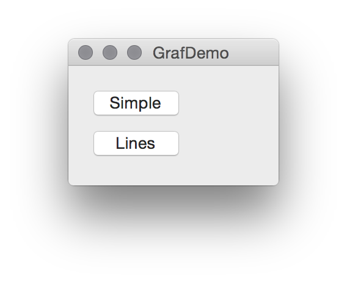
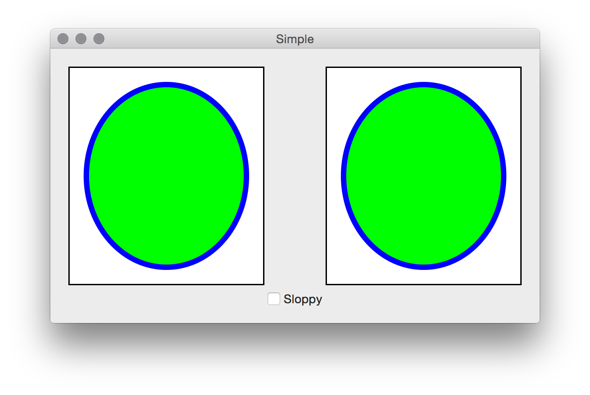
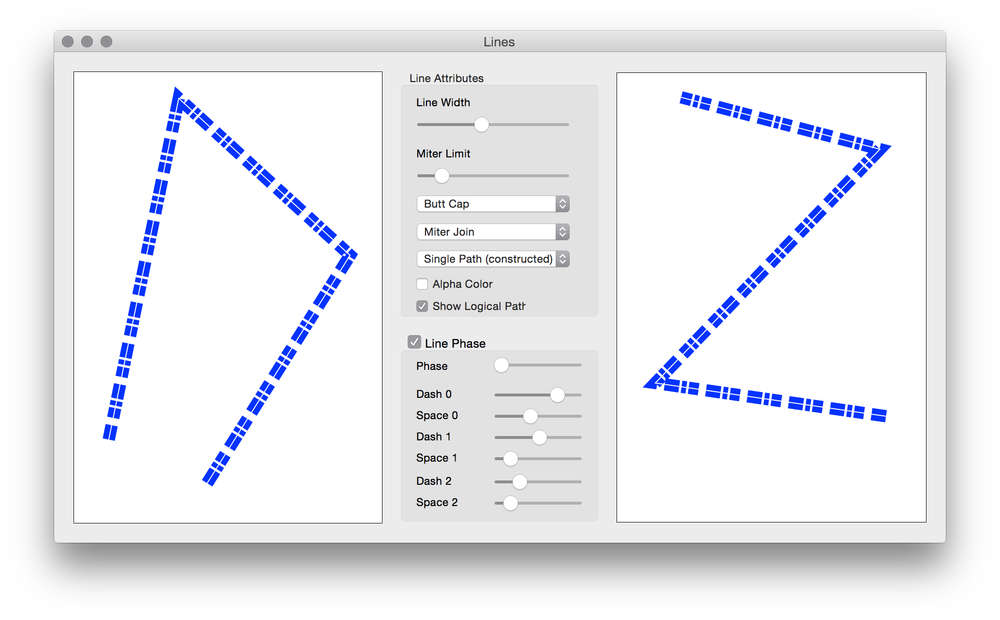
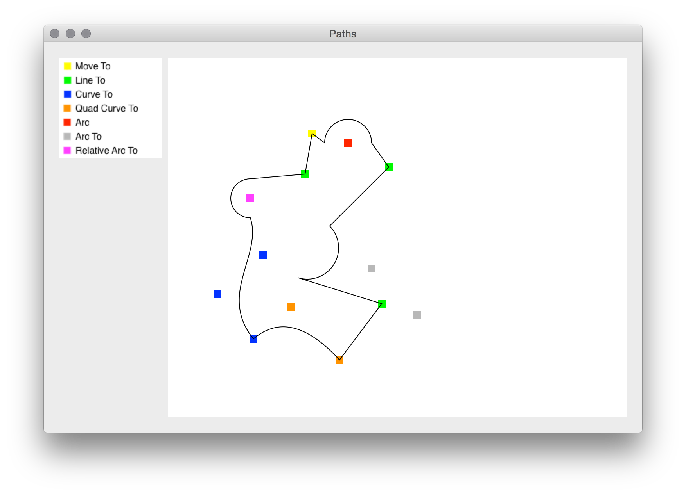
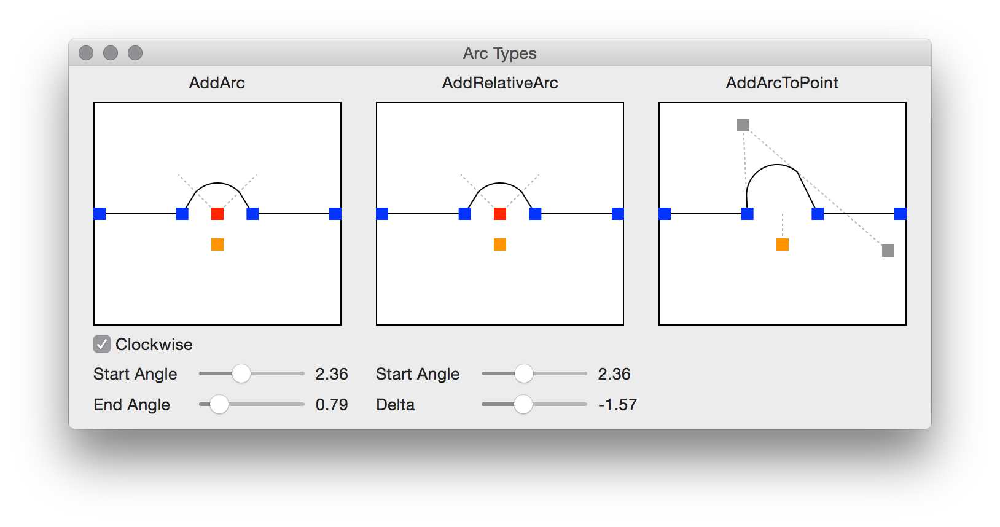
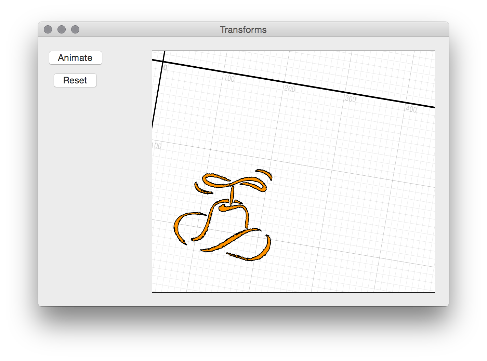
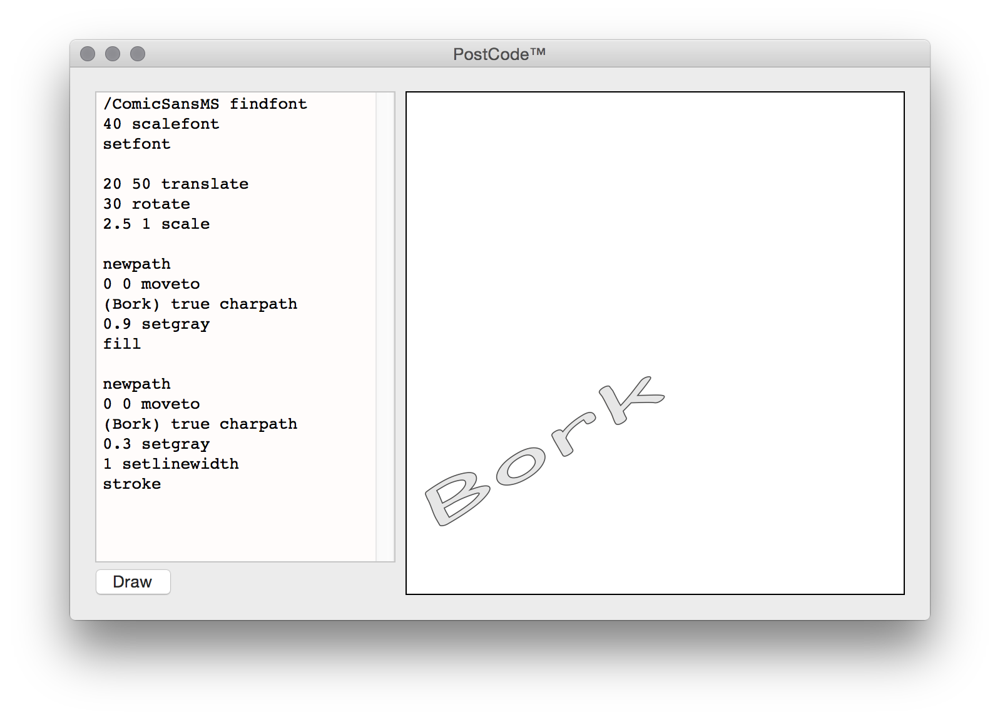

GrafDemo
========

A little demo program showing off various Core Graphics features.  It's a sample program
for a set of posts over at the Big Nerd Ranch blog:

* [In the Beginning](https://www.bignerdranch.com/blog/core-graphics-part-1-in-the-beginning/)
* [Contextually Speaking](https://www.bignerdranch.com/blog/core-graphics-part-2-contextually-speaking/)
* [Lines](https://www.bignerdranch.com/blog/core-graphics-part-three-lines/)
* Paths (forthcoming)

Digital Dashboard
-----------------

Behold the main menu it all of its glory:

For the demo windows, the left-hand view is implemented in Objective-C, the
right-hand view is implemented in Swift, and the window controllers
alternate ObjC and Swift implementations.

Simple
------

**Simple** is a view that shows basic drawing, as well as [GState hygiene](https://www.bignerdranch.com/blog/core-graphics-part-2-contextually-speaking/).  The "Sloppy"
toggle turns off some GState management, showing attribute settings leak out in other
method's drawing.

Lines
-----
Here are things related to lines.  End caps, line joins, drawing mechanisms, and
line phases.

Paths
-----
A sampler of the different path component calls.  Click and drag the control points to
see how they behave.

Arcs
----
The plethora of "arc" calls are confusing.  Here they are with influence lines
and tweakable settings.

Transforms
----------
Transformations are a-fine thing.

PostScript
----------
A bit of history - Core Graphics is based on the PostScript drawing model.  CG also
includes a full postscript interpreter. This window lets you enter code and run it.
Worst IDE Evar.

